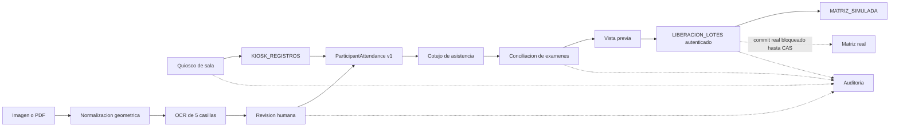

# Arquitectura

## Vertical comun

Las rutas convergen antes de preliberacion. Ningun adaptador de entrada puede
modificar directamente la matriz.

## Capas

1. **Contratos compartidos.** `Session`, `Participant`, `Attendance`,
   `ParticipantAttendance`, `KioskRegistration`, `OcrDocument`, `OcrCandidate`,
   `ExamReconciliation`, `Release`, `ReleaseBatch`, `AuditEvent` y `Evidence`,
   todos en version `1.0.0`.
2. **Dominio.** Reglas puras de identidad, duplicados, estados, elegibilidad,
   conciliacion, vista previa, idempotencia y auditoria.
3. **Puertos.** Repositorios, `OcrProvider`, `EvidenceStore` y `MatrixGateway`.
4. **Adaptadores locales.** Padron, auditoria y matriz en memoria; normalizador
   raster real, proveedor simulado, Tesseract 5 y clasificador tipografico
   restringidos a digitos; evidencia transaccional en memoria y fixtures
   sinteticos deformados con verdad geometrica.
5. **Adaptadores Google.** Apps Script V8, Sheets en lote, Drive, CacheService,
   PropertiesService, LockService y HTML Service.

## OCR

La pagina completa se usa para localizar y normalizar la hoja, no como unica
entrada de reconocimiento. La secuencia es: validacion binaria, hash, deteccion
de plantilla, correccion de perspectiva/rotacion, alineacion, 40 renglones,
cinco casillas por renglon, reconocimiento restringido a digitos, confianza por
digito y total, validacion contra padron y revision humana.

`OcrProvider` permite proveedor simulado, Tesseract, clasificador tipografico
conservador y un futuro adaptador Cloud Vision. La opcion Vision usaria
`POST /v1/images:annotate`; no se habilito porque
requiere un proyecto con facturacion y autorizacion. La API cobra por imagen y la
primera franja mensual puede variar; antes de un piloto debe revisarse la
[tarifa oficial](https://cloud.google.com/vision/pricing) y sus
[cuotas](https://docs.cloud.google.com/vision/quotas).

### Frontera de despliegue

Apps Script no ejecuta el binario Tesseract. La plataforma, autorizacion,
evidencia, reglas y revision permanecen en Apps Script; si se exige Tesseract,
el computo de imagen se aloja como worker contenedorizado. Cloud Run es la
opcion recomendada y Supabase no forma parte de la arquitectura. La decision y
alternativas se justifican en `docs/DECISION_DESPLIEGUE_OCR.md`.

Hay dos contratos remotos distintos y deliberados:

1. El contrato **documento** comunica Apps Script con el worker. Transporta una
   pagina validada, hash, version de plantilla y `requestId`; devuelve 40 x 5,
   tiempos y los pares de recortes visual/procesado que Apps Script persiste en
   Drive. La pagina puede contener numeros, nombres y firmas visibles, por lo
   que el worker es un procesador de datos personales. No recibe el padron como
   tabla ni metadatos estructurados de puesto, examen o matriz.
2. El contrato **digitos** implementa `OcrProvider` dentro del pipeline Node.
   Transporta exactamente los 200 PNG procesados con hash y permite sustituir
   Tesseract por otro reconocedor REST sin cambiar normalizacion, validacion ni
   revision. Esos recortes contienen el identificador manuscrito y tambien se
   tratan como datos personales, aunque no incluyan el resto de la hoja.

La implementacion local conserva ambos adaptadores desacoplados. Ningun endpoint
fue desplegado ni se habilito facturacion. Para Cloud Run se prefiere IAM con ID
token y cuenta de servicio sin llave; HMAC queda como modo alterno de prueba.

`KcmRemoteOcrProcessingService` implementa la union servidor a servidor: verifica
la evidencia original en Drive, inicia el estado OCR, invoca el worker, convierte
las 40 filas a candidatos con banderas tecnicas, persiste resultados una sola
vez y entrega los 200 pares al productor idempotente de recortes. El resultado
incluye versiones efectivas de Node, Tesseract, Poppler, pipeline e imagen de
contenedor; Apps Script las persiste en documento, journal y auditoria. Un fallo
entre candidatos y recortes se reanuda con el mismo `requestId`; un resultado
remoto distinto o un runtime diferente nunca sustituye silenciosamente
candidatos existentes. El tiempo observado no forma parte de la identidad del
contenido. El router sólo devuelve conteos, version, progreso y tiempo, no bytes
ni lecturas completas.

Antes de leer Drive o invocar el worker se persisten la transicion, el evento
idempotente `OCR_PROCESSING_STARTED` y la concesion durable. Un replay con el
mismo `ocrRequestId` reconcilia candidatos existentes con asistencias y repara,
sin duplicar, `OCR_RESULTS_INGESTED` y `OCR_ATTENDANCE_CAPTURED`. La concesion se
limpia al terminar o fallar; si esa limpieza no fuera posible, expira y solo el
request original puede recuperarla.

Los 200 pares se almacenan en fragmentos deterministas bajo bloqueos cortos. Si
se alcanza el presupuesto de ejecucion, el documento permanece
`OCR_EN_PROCESO`, se conserva el journal y la UI reintenta con el mismo
`requestId`; sólo un journal `COMPLETADO` habilita `REVISION_OCR`. El reintento
actual vuelve a invocar el worker porque los binarios aun pendientes no se
persisten como cache intermedia.

Antes del cotejo, un gate durable verifica el original, 40 filas remotas, cinco
pares por fila, hashes, asociaciones y journal completo. Cada fila debe terminar
confirmada con identidad o como `CONFIRMADO_VACIO` por una persona autorizada,
con actor, fecha y motivo. Una fila vacia no crea asistencia y aparece como
exclusion OCR informativa en el resumen; una correccion que retracta un falso
positivo neutraliza la asistencia OCR anterior sin borrarla ni afectar capturas
digitales.

La ruta local `runRasterOcrPipeline` valida y hashea el original, rasteriza un
PDF de una pagina cuando existe adaptador, normaliza PNG/JPEG a 1216 x 2002,
detecta la hoja con un modelo robusto del fondo, calcula homografia, recorta 200
casillas y entrega esos recortes al proveedor. En macOS el adaptador PDF usa
`sips` y compone la transparencia sobre blanco; en otra plataforma falla con un
estado recuperable hasta configurar Poppler u otro rasterizador. Los binarios
normalizados no se guardan en Sheets.

El pipeline raster exige un proveedor explicito; la simulacion requiere una
bandera adicional. Un fallback de pagina completa, una advertencia geometrica o
confianza de alineacion menor a 0.8 añade `PAGE_ALIGNMENT_REVIEW_REQUIRED` a
toda lectura no blanca. Los binarios normalizados y los 200 recortes se omiten
del DTO por defecto y sólo se incluyen mediante opciones internas para generar
evidencia protegida.

Tesseract es la referencia local. `GlyphTemplateDigitsProvider` mejora el banco
tipografico sintetico, pero limita por codigo su confianza a 0.93 y por ello
obliga revision. Ninguno esta aprobado para escritura manuscrita o produccion.
Cualquier lectura sin cinco digitos, con confianza baja o sin coincidencia en
padron pasa a revision. Detalles y metricas: `docs/OCR_LOCAL.md`.

`OcrJobOrchestrator` define una unidad recuperable por documento, hash y version
de pipeline. Deduplica carreras, ejecuta reintentos con backoff, registra estados
y errores sanitizados y solo publica el resultado cuando las 200 casillas tienen
sus referencias de evidencia completas.

### Contrato de revision

`createReviewBundle` convierte candidatos y la extraccion completa de 200
casillas en un DTO sanitizado de hasta 40 filas. Cada fila contiene cinco
`slots` ordenados con `cropId`, confianza, banderas, hash y una referencia
opaca para las variantes visual y procesada; nombres, padron y buffers quedan
fuera del DTO. `createReviewEvidenceResolver` verifica cardinalidad, hash,
asociacion candidato-fila-casilla e IDs antes de devolver copias defensivas.

La previsualizacion local sirve este contrato solamente en loopback. La UI pide
la evidencia al seleccionar un renglon, muestra cinco pares y espera los diez
eventos de carga reales antes de habilitar la correccion. Apps Script conserva
en `OCR_RESULTADOS.cropEvidenceRefs` como maximo cinco referencias de metadatos,
y `reviewEvidence` resuelve los blobs vinculados desde Drive sin aceptar
`evidenceId` ni `driveFileId` enviados por el cliente. La llamada agregada lee
como maximo diez blobs y deja un solo evento de auditoria.

`ReviewEvidenceProducer` crea atomicamente en el adaptador local dos objetos por
casilla, 400 por hoja, con idempotencia basada en documento, casilla, variante y
hash. El productor Google `storeOcrCropEvidenceBatch` acepta lotes autorizados
de 1 a 200 pares, guarda blobs privados en Drive y escribe referencias por lote.
Como Drive y Sheets no comparten transaccion, usa nombres deterministas,
`ScriptLock` y el journal `OCR_RECORTES_LOTES` para recuperarse.

## Persistencia en Google Sheets

Las hojas definitivas se acceden por encabezado estable, nunca por offsets
dispersos: `CONFIG`, `EMPLEADOS`, `CAPACITACIONES`, `SESIONES`, `ASISTENCIAS`,
`KIOSK_REGISTROS`, `OCR_DOCUMENTOS`, `OCR_RESULTADOS`, `OCR_RECORTES_LOTES`, `EVIDENCIAS`,
`EXAMENES`, `LIBERACIONES`, `LIBERACION_LOTES`, `MATRIZ_MAPEO`, `AUDITORIA` y
`ERRORES`. Los
repositorios leen rangos completos, indexan en memoria y escriben matrices con
`setValues`.

En modo de prueba se agrega `MATRIZ_SIMULADA`; nunca sustituye ni apunta a la
matriz productiva.

Los binarios permanecen en Drive. Sheets conserva metadatos, hash y referencias
de evidencia.

Una hoja creada con el esquema anterior requiere agregar `cropEvidenceRefs` a
`OCR_RESULTADOS` y crear `EVIDENCIAS` y `OCR_RECORTES_LOTES` antes de usar la
revision visual. Tambien debe crear `KIOSK_REGISTROS`, crear
`LIBERACION_LOTES` con `journalMac` y agregar `batchId`, `planHash` y `marker` a
`MATRIZ_SIMULADA`. El adaptador esta implementado con mocks; la validacion contra
Drive/Sheets reales permanece pendiente de autorizacion.

## Concurrencia e idempotencia

La clave efectiva combina sesion, trabajador, capacitacion y version de mapeo.
La liberacion adquiere `LockService.getScriptLock()`, autentica todos los
journals de la sesion y solo reanuda un lote no terminal con su `requestId`
original. Antes de cada efecto vuelve a leer sesion, autorizacion, cierre OCR,
elegibilidad y el unico mapeo activo; el mapeo no usa cache en esta ruta.

`LIBERACION_LOTES` conserva plan y resultados serializados. `journalMac` es un
HMAC con separacion de dominio que cubre identidad, request, plan/hash,
resultados, fase, estado, actor, fechas y version. Cada cambio de fase vuelve a
firmar el registro. El contexto entregado al gateway tambien lleva un HMAC
ligado al `journalMac` vigente. El marcador `KCM_RELEASE_V2` de cada efecto usa
otro dominio HMAC y queda ligado al `batchId`, de modo que un request nuevo no
puede adoptar el efecto de un lote pendiente. Antes de tocar el dominio se
verifica nuevamente el efecto contra la matriz simulada y el journal.

El candado excluye ejecuciones del script, pero no ediciones externas a Google
Sheets. Como la API usada no ofrece CAS por celda, el gateway real es
deliberadamente de solo lectura: permite vista previa y rechaza todo commit.
No se afirma atomicidad ni `NO_OVERWRITE` productivo. Habilitar escritura exige
otro gateway con una precondicion atomica demostrable y sus propias pruebas.
LockService se usa segun la
[referencia oficial](https://developers.google.com/apps-script/reference/lock/).

## Restricciones operativas conocidas

Apps Script documenta 6 minutos por ejecucion, 50 MB por peticion/respuesta de
URL Fetch, 30 ejecuciones simultaneas por usuario y 1,000 por script; las cuotas
pueden cambiar. El diseño procesa una hoja OCR por trabajo recuperable y todas
las escrituras tabulares son por lote. Ver
[cuotas oficiales](https://developers.google.com/apps-script/guides/services/quotas).

Las llamadas `google.script.run` son asincronas y no garantizan orden. Las
mutaciones publicas exigen `requestId`; las reparaciones internas usan
identidades durables y eventos unicos para no duplicar efectos, de acuerdo con
la [guia de comunicacion de HTML Service](https://developers.google.com/apps-script/guides/html/communication).
