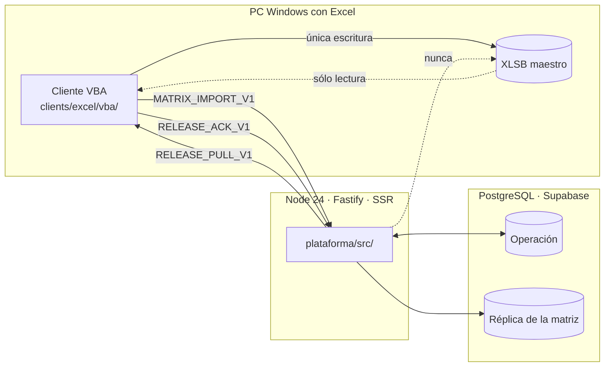

# Arquitectura

Mapa del sistema tal como está construido hoy. Describe dónde vive cada cosa y
quién puede escribir qué; no repite las decisiones que lo sostienen, que están
en [`DECISIONES.md`](DECISIONES.md), ni el contrato de datos, que está en
[`MODELO_DATOS.md`](MODELO_DATOS.md).

---

## Los dos escritores, y por qué no chocan

Ésta es la decisión que explica el resto del diseño. Hay **dos escritores sobre
el mismo dato** —la fecha de curso por trabajador— y eso es deliberado:

- **El XLSB maestro es dueño del historial de fechas.** Sólo lo escribe el
  cliente VBA, sobre destinos declarados. **Node no toca el archivo jamás.**
- **SQL es dueño de la operación** —sesiones, quiosco, asistencia,
  preliberación, liberación, salas, auditoría, reglas DNC, atributos declarados
  y bitácora DC-3— y guarda además una réplica consultable de la matriz.
- El conflicto **se resuelve por procedencia, nunca por orden de llegada**: una
  fecha que escribió el maestro se corrige siguiéndolo; una fecha liberada por
  la plataforma no se altera desde una importación.

La liberación termina en Node dejando cada efecto en `PENDIENTE_ACUSE`. El
empuje físico y su acuse son del puente VBA.

---

## La aplicación

`app/` es un monolito modular en TypeScript **sin paso de compilación**: Node 24
borra los tipos al cargar el módulo, así que los `.ts` se ejecutan directos y
`tsc` queda sólo como verificador. La contrapartida es sintaxis borrable
únicamente —sin `enum`, sin propiedades en parámetros del constructor, sin
`namespace`— y extensión `.ts` en los imports relativos.

| Capa | Ruta | Qué contiene |
|---|---|---|
| Dominio | `plataforma/src/domain/` | Trece módulos de reglas puras: `acceso`, `barrido-matriz`, `cargas`, `consola-interna`, `dc3`, `excel`, `importacion-matriz`, `liberacion`, `padron`, `preliberacion`, `quiosco`, `salas`, `sistema-trabajador` |
| Puertos | `plataforma/src/ports/` | Las interfaces que el dominio exige; ningún detalle de PostgreSQL las cruza |
| Adaptadores | `plataforma/src/adapters/` | Dos implementaciones por puerto: `memoria/` para pruebas y corridas locales, `postgres/` contra la base |
| Rutas | `plataforma/src/routes/` | Dieciséis módulos Fastify: SSR, API, CSV de Power Query y `/healthz` |
| Web | `plataforma/src/web/` | Render en servidor. Detalle en [`SISTEMA_DE_DISENO.md`](../referencia/SISTEMA_DE_DISENO.md) |
| Servidor | `plataforma/src/server/` | Construcción de la instancia, sesión de consola, multipart y traducción de errores |
| Observabilidad | `plataforma/src/observability/` | Registro de eventos sin datos personales |
| Configuración | `plataforma/src/config/` | Entorno validado; falla cerrada, sin secretos en el árbol |

El par memoria/Supabase no es ceremonia: es lo que permite que la suite corra
**sin credenciales y sin base**, que es una regla del proyecto.

**El front no son archivos `.html`.** El marcado se genera desde TypeScript en
`plataforma/src/web/pages/`; lo único que viaja como archivo es el CSS. La política de
contenido prohíbe scripts en la consola, así que las pantallas se operan con
formularios.

---

## La base

PostgreSQL en Supabase Hosted. El DDL vive versionado en `database/migrations/`
(0001 en adelante) y **no se aplica ninguna migración sin confirmación
explícita del departamento**.

- Seguridad por fila **forzada y cerrada por omisión en cada tabla**.
- Ledgers con trigger de inmutabilidad: sólo se agrega, no existe edición.
- Dominio de cinco dígitos para el número de nómina, que nunca es numérico.
- Exclusión GiST contra traslape de reservaciones de sala.
- Tablas repartidas en ocho esquemas por dominio (`organizacion`, `catalogo`, `operacion`, `matriz`, `dnc`, `dc3`, `seguridad`, `sistema`) y superficie de lectura separada en el esquema `lectura`.

Justificación tabla por tabla en [`database/README.md`](../../database/README.md) y
[`database/JUSTIFICACION.md`](../../database/JUSTIFICACION.md).

---

## Lo que rodea a la aplicación

| Componente | Ruta | Papel |
|---|---|---|
| Cliente VBA | `clients/excel/vba/` | Único escritor del XLSB. Diecisiete módulos ASCII puro que corren en Excel para Windows y para Mac, con todo lo dependiente del sistema en `KcmPlataforma` y un linter propio (`npm run lint:vba`) que lo exige, porque aquí no hay Excel para compilarlos. Contrato en [`VBA_BRIDGE.md`](../referencia/VBA_BRIDGE.md) |
| DC-3 | `packages/dc3/` | Compositor PDF de la constancia, sin dependencias, y lector del padrón activo. La emisión vive en la consola (`/dc3`). Ver [`DC3_AUTOMATIZACION.md`](../referencia/DC3_AUTOMATIZACION.md) |
| Reglas DNC | `packages/dnc/` | Catálogo unificado y motor de aplicabilidad en dos niveles: `department` para los cursos de calidad, `area` para los técnicos |
| Lector XLSB | `packages/xlsb/` | Extracción ZIP/BIFF12 de valores cacheados. No automatiza Excel, no ejecuta macros, no recalcula fórmulas |
| Contratos | `packages/contracts/` | Contratos versionados y máquina de estados |
| Núcleo de referencia | `packages/core/` | Implementación de referencia de elegibilidad y liberación. La consumen las pruebas de caracterización; ningún import de `plataforma/src/` la alcanza |

---

## Despliegue

Una sola imagen, dos papeles. `KCM_ROLE` los declara y vale `local` por omisión.

| Papel | Dónde corre | Qué hace |
|---|---|---|
| `local` | Equipo del departamento | Todo. Disco propio y sin techo de tamaño: el snapshot completo de la matriz y el padrón semanal |
| `nube` | Alojamiento publicado | Las pantallas, las actualizaciones ligeras de fechas y las constancias DC-3, con topes menores. Rechaza con explicación las dos operaciones pesadas |

El reparto no es una preferencia: un alojamiento efímero corta las peticiones en
4.5 MB y no conserva disco entre una y otra. El puente declara 24 MiB porque por
ahí viaja el libro entero. Eso no cabe en la nube, y cabe de sobra en la
máquina donde ya está el Excel que lo origina. Las constancias DC-3 sí caben:
400 en un PDF pesan unos 3 MB.

Lo que **no** se parte es la verdad: los dos procesos hablan con la misma base y
no divergen, porque los ledgers son de sólo agregar e idempotentes —el mismo
motivo por el que ya conviven dos escritores—.

Un solo servicio publicado: la plataforma Node.

- **Imagen**: `infra/docker/Dockerfile`; blueprint en [`render.yaml`](../../render.yaml).
- **Desarrollo en contenedores**: `infra/compose.yaml` y `infra/docker/`, documentado en
  [`DESARROLLO_DOCKER.md`](../operacion/DESARROLLO_DOCKER.md).
- **Publicación**: un único nombre de dominio HTTPS hacia Node. Con
  `KCM_ENV=production`, `loadConfig` exige que salir del loopback sea una
  decisión declarada y no un descuido.
- **Migraciones**: se aplican desde fuera del contenedor; `main.ts` sólo
  verifica que el esquema ya exista.
- **Sin binarios nativos.** El compositor PDF se escribe a mano y el lector
  XLSB es ZIP/BIFF12 puro, así que la imagen no necesita ninguna dependencia
  compilada. Las dependencias de ejecución son dos: `fastify` y `pg`.

Correr dentro de la red de la planta es una opción abierta y evaluada en
[`MIGRACION_SERVIDORES_INTERNOS.md`](../operacion/MIGRACION_SERVIDORES_INTERNOS.md).

---

## Frontera de privacidad

El repositorio tiene remoto en GitHub. Están ignorados por Git y verificados con
`git check-ignore`: `referencias/privado/`, `referencias/*.xlsb` y toda la
carpeta `referencias/Software Administración de Curs y Cap/`, que contiene el
padrón con CURP, la plantilla oficial firmada y el DNC con nombres reales.

Esas fuentes nunca se publican, nunca se usan como fixtures, las pruebas usan
datos sintéticos y cualquier identidad que aparezca en una vista previa es
inventada. La guarda vive en CI (`.github/workflows/ci.yml`) y en
`tools/check/proyecto.js`, no en la disciplina de quien hace `git add`.
