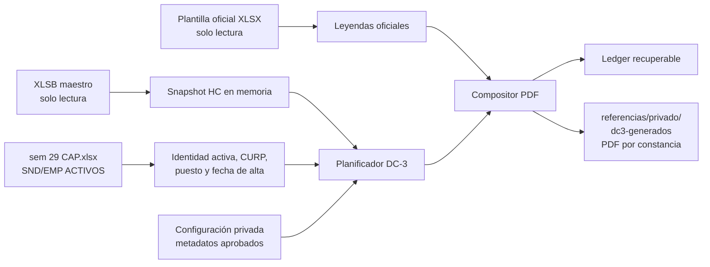

# Automatización de constancias DC-3

Estado: **LISTA PARA EMITIR EN CUANTO SE APRUEBEN LOS METADATOS**. El cruce, la
validación de identidad, el ledger y la composición del documento final están
resueltos y probados de extremo a extremo. Cada constancia se entrega como PDF
de una página, no como hoja de cálculo. La emisión con datos reales
permanece bloqueada hasta aprobar por curso duración, área temática y agente
capacitador; ésos son los únicos datos que faltan y se capturan en
configuración, sin volver a tocar código.

## Decisión de arquitectura

Adenda del 2026-07-29: para la operación sin servidor se implementó un cliente
VBA único con módulos separados de liberación, snapshot y DC-3.

Adenda del 2026-08-01 que revierte la anterior en lo que toca a DC-3: **la
emisión vuelve a ser exclusiva del worker Node de este documento** y el módulo
`KcmDc3` se eliminó del cliente VBA. Dos rutas de emisión sobre la misma
plantilla oficial pueden producir dos constancias del mismo curso al mismo
trabajador, cada una con su folio, sin que ninguno de los dos ledgers vea a la
otra; y este worker ya componía el PDF de una página, que la ruta VBA no
alcanzaba. El cliente VBA conserva liberación y snapshot, que sí exigen estar
del lado de Excel: ver `docs/VBA_BRIDGE.md`.

La premisa de que agregar DC-3 a la plataforma necesariamente la hará lenta se
rechaza. El tamaño del código no es el factor dominante: el riesgo aparece si
una llamada interactiva escanea miles de filas, copia plantillas y convierte
archivos antes de responder al navegador.

El módulo se implementó como worker Node local, dentro del stack que el
repositorio ya usa. No añade Supabase, no entra en `google.script.run`, no toma
el `ScriptLock` de quiosco/OCR y no consume las cuotas de conversión de Apps
Script. Puede ejecutarse con el Programador de tareas de Windows o `launchd` en
macOS después de aprobar la configuración privada.

La decisión mantiene el cruce y la composición fuera de la petición
interactiva: una pantalla publica el estado del ledger o el vínculo ya generado,
nunca dispara la generación dentro de la respuesta.

Eso también evita quedar sujeto a los límites de una plataforma de ejecución
ajena —tiempo máximo por invocación, cuotas diarias de conversión— que pueden
cambiar sin aviso:

- https://developers.google.com/apps-script/guides/services/quotas
- https://developers.google.com/apps-script/guides/support/best-practices
- https://developers.google.com/apps-script/guides/triggers/installable

## Flujo y fuentes



Los tres originales se leen con control de tamaño, rutas, CRC y estabilidad de
`inode`, tamaño y fecha de modificación. El worker nunca reescribe los archivos
fuente ni convierte el XLSB.

## El documento que se entrega es un PDF

La plantilla oficial es una hoja de cálculo. Impresa arrastra la cuadrícula, los
renglones descuadrados de las celdas combinadas y, sobre todo, el reverso con
los dos catálogos —áreas y subáreas del Catálogo Nacional de Ocupaciones y áreas
temáticas de los cursos—, que son material de consulta para llenar el formato y
no parte de la constancia que recibe el trabajador. Entregar eso es entregar un
borrador.

Por eso el PDF no se convierte desde la hoja: se compone. `packages/dc3/pdf/` escribe
el archivo a mano, sin dependencias, con las fuentes base Helvetica que todo
lector incluye. Lo que se conserva del archivo oficial son sus leyendas —título,
encabezados de las tres secciones, etiquetas de cada campo, razón social y RFC
del patrón, protesta de decir verdad, pies de firma e instrucciones—, leídas
celda por celda. Si la plantilla dejara de declarar una de ellas, la emisión se
detiene en vez de imprimir una sección muda.

Consecuencias deliberadas:

- El anverso se imprime completo en una página; el reverso de consulta no se
  imprime nunca, y una prueba sobre el archivo oficial lo comprueba.
- La leyenda oficial de instrucciones sigue mencionando «el reverso de este
  formato». Es redacción de la STPS y se conserva textual: también remite a
  www.stps.gob.mx, que es donde esos catálogos están publicados.
- El nombre de curso largo de LOTO se ajusta hasta caber en dos renglones. Si
  algún contenido no cupiera en la página, el generador falla en lugar de
  recortar texto legal.
- El PDF no hereda nada del origen: ni rutas locales, ni autores, ni fecha de
  generación. Su fecha interna es la del curso, de modo que dos corridas del
  mismo DC-3 producen exactamente los mismos bytes y el ledger las reconoce como
  la misma constancia.
- La razón social se imprime tal como está en la plantilla. La entregada dice
  `KIMBERL- CLARK`; mientras no se corrija ahí, `employer.legalName` en la
  configuración privada permite imprimir la correcta sin editar el archivo
  oficial. Ese valor viaja en la huella: cambiarlo no reemite en silencio.

## Reglas de detección

- Corte único: `2026-01-01`, inclusive.
- `INDUCCION_EMPRESA`: un trabajador en `SND ACTIVOS` o `EMP ACTIVOS` queda
  detectado cuando su fecha de alta es igual o posterior al corte; esa fecha es
  la fecha del curso.
- `QMS`: se toma la primera fecha de QMS igual o posterior al corte.
- `LOTO`: se unen las columnas fuente cuya identidad normalizada corresponde al
  nombre largo solicitado y se toma la primera fecha igual o posterior al
  corte. El año del encabezado queda como trazabilidad, pero la fecha de celda
  manda.
- El objetivo es una constancia por trabajador y curso, no una por cada
  repetición. Una fecha posterior no sobrescribe una constancia existente.
- Todo documento requiere una identidad vigente en las páginas de activos, un
  número normalizable a cinco dígitos, nombre, CURP válida, puesto y fecha de
  alta válida. Una discrepancia queda bloqueada; no se completa con datos
  inferidos.
- El campo de ocupación específica se llena con la **clave de ocupación del
  trabajador**, que el padrón semanal trae en una columna opcional al final de
  sus dos hojas de activos, titulada **`Clave de ocupación`** —rótulo declarado
  el 2026-08-13 y marcado como provisional por el departamento—. Queda vacío
  mientras esa columna no traiga clave para esa persona y su puesto tampoco
  tenga el mapeo de respaldo. El puesto sí se llena siempre desde el padrón.

  El rótulo se compara ya normalizado, así que acentos, mayúsculas, puntos y
  espacios dan igual, y se siguen aceptando las formas anteriores —`CLAVE CNO`,
  `CNO`, `OCUPACION CNO`, `CLAVE OCUPACION`, `OCUPACION ESPECIFICA`, las dos
  largas del catálogo y las cuatro de «tipo de trabajo»—: los libros de semanas
  pasadas traen `CLAVE CNO`, y volverlos ilegibles al renombrar convertiría una
  mejora en una interrupción. La posición no importa: se resuelve por nombre en
  el renglón 1.

  La clave vive en el trabajador y **no en el puesto** desde la migración `0041`
  (2026-08-12). La versión anterior la consolidaba por puesto y rechazaba sin
  escribir el puesto que llegaba con dos claves distintas; el departamento
  corrigió la premisa: la clave varía según el puesto **y el área** de cada
  quien, así que un mismo puesto en dos áreas trae legítimamente dos claves y
  consolidarlas perdía las dos. `kcm.puesto.clave_cno` se conserva como respaldo
  de quien todavía no tiene clave propia; el padrón ya no lo escribe.

## Metadatos que faltan aprobar

La matriz sólo aporta curso y fecha. Para una DC-3 utilizable todavía se deben
aprobar por cada uno de los tres cursos:

1. duración en horas;
2. área temática que debe imprimirse;
3. nombre o registro aprobado del agente capacitador.

La referencia SIRCE histórica de LOTO contiene dos duraciones diferentes, 8 y
12 horas, por lo que el worker no escogió una automáticamente. QMS e Inducción
tampoco contienen esos metadatos en las fuentes entregadas. El archivo de
ejemplo deja los campos vacíos y produce bloqueos agregados, nunca documentos
incompletos.

Un candidato al que le falte cualquiera de los tres queda bloqueado entero, con
su motivo, antes de que se toque el sistema de archivos: no existe un estado
intermedio en el que la constancia salga con un campo vacío. El resumen los
distingue de los bloqueos de origen —identidad ausente, CURP inválida, puesto o
fecha de alta faltantes— porque unos se resuelven capturando configuración y los
otros corrigiendo la fuente:

```json
"readiness": {
  "metadataApproved": false,
  "canEmit": false,
  "coursesPendingMetadata": [{ "courseId": "QMS", "missingMetadata": ["..."] }],
  "emitOnApproval": 1743,
  "blockedBySource": 0,
  "sourceIssues": {}
}
```

## Configuración y ejecución

Primero se crea una copia privada:

```bash
cp config/dc3-generator.example.json referencias/privado/dc3-config.json
```

En la copia privada se completan `durationHours`, `thematicArea` y
`trainingAgent` para cada curso. Las firmas sólo se agregan si se desea
sobrescribir de forma explícita las que ya conserva la plantilla.

El plan es seguro por defecto y sólo publica conteos e hashes:

```bash
npm run dc3:plan -- --config referencias/privado/dc3-config.json
```

`dc3:check` responde con un código de salida si todavía falta capturar algo, y
sirve para vigilancia programada sin leer el JSON completo:

```bash
npm run dc3:check -- --config referencias/privado/dc3-config.json
```

`dc3:report` deja el detalle por candidato bloqueado, con su motivo y la hoja y
fila de origen, dentro de `referencias/privado/` y con permisos `0600`:

```bash
npm run dc3:report -- --config referencias/privado/dc3-config.json
```

La escritura exige una bandera distinta:

```bash
npm run dc3:generate -- --config referencias/privado/dc3-config.json
```

Códigos de salida: `0` correcto, `1` error, `2` conflictos sin sobrescribir,
`3` metadatos legales pendientes.

### El día de la aprobación

Cuando Capacitación entregue los tres metadatos, el procedimiento completo es:

1. capturarlos en la copia privada de la configuración;
2. `npm run dc3:check` hasta que salga con `0`;
3. `npm run dc3:plan` y conciliar los conteos;
4. `npm run dc3:generate`.

No hay ningún paso de reproceso: el cruce, la identidad, el ledger y la
plantilla ya están fijados. `readiness.emitOnApproval` anticipa desde hoy
cuántas constancias saldrán en ese momento.

`dc3:generate` se niega a correr —salida `3`— mientras algún curso configurado
tenga metadatos pendientes. Un lote a medias no se puede deshacer, porque el
ledger fija lo ya emitido. Si Capacitación aprueba un curso antes que los otros,
la emisión parcial es legítima pero debe pedirse a propósito:

```bash
npm run dc3:generate -- --config referencias/privado/dc3-config.json --allow-partial
```

Los cursos aprobados se emiten y el resto queda bloqueado con su motivo. Cuando
después se aprueben los faltantes, la corrida siguiente genera únicamente los
nuevos y reporta los anteriores como repetidos, sin conflictos.

## Banco de pruebas local

El resto del ecosistema se prueba en un navegador —`preview:ocr` y
`preview:platform`—; DC-3 sólo se podía revisar leyendo JSON en la terminal, y
las tres preguntas que más importan antes de la aprobación son visuales: cuántas
constancias salen con cierta duración, cómo queda impreso el formato oficial y
si la emisión completa se comporta como está documentada.

```bash
npm run preview:dc3
npm run preview:dc3 -- --config referencias/privado/dc3-config.json --port 4180
```

El servidor escucha sólo en `127.0.0.1:4175`, valida `Host` y origen y responde
con `no-store`. Tiene cuatro paneles:

1. **Metadatos de ensayo**: duración, área temática, agente y las tres firmas.
   Se aplican sobre una copia en memoria de la configuración; cerrar el proceso
   los descarta y la configuración privada no se toca. Aprobar sigue siendo
   capturarlos en `referencias/privado/dc3-config.json`.
2. **Plan sobre las fuentes reales**: ejecuta el mismo punto de entrada que
   `npm run dc3:plan`, en sólo lectura, y publica exactamente los mismos
   agregados. Una corrida completa sobre las referencias entregadas tarda unos
   140 ms, así que responde a cada cambio de metadatos sin caché.
3. **Vista previa de la constancia**: compone el PDF con una identidad inventada
   y los metadatos capturados, lo muestra en pantalla, lo ofrece para descargar y
   lista campo por campo lo que quedó impreso. No consulta el padrón ni escribe
   nada.
4. **Ensayo de emisión**: única ruta con escritura. Emite contra un padrón
   sintético en una carpeta temporal fuera del proyecto, corre dos veces y
   compara: la segunda vuelta debe reportar repetidas y cero nuevas. La carpeta
   se elimina al terminar.

Dos límites lo mantienen seguro y son parte del contrato, no una omisión:

- Ningún nombre, número de nómina o CURP sale por HTTP. Sobre datos reales el
  banco publica conteos y hashes; los únicos datos personales que aparecen en
  pantalla son inventados. El detalle por candidato sigue siendo
  `npm run dc3:report`, que lo deja en `referencias/privado/` con modo `0600`.
- La emisión real no tiene botón. Un lote no se deshace porque el ledger fija lo
  emitido, así que sigue siendo un acto deliberado de `npm run dc3:generate`,
  con su lock, su ledger y sus códigos de salida.

## Idempotencia, privacidad y recuperación

- La identidad lógica es un SHA-256 de trabajador + curso. El nombre del
  archivo usa un hash estable, no el nombre ni el número de nómina.
- La huella efectiva incluye los datos impresos en la constancia —identidad,
  curso, fecha, los tres metadatos legales y las firmas—, la fecha de corte y
  el hash de la plantilla. `configVersion` queda deliberadamente fuera: es una
  etiqueta humana y se guarda en el ledger sólo como dato de auditoría. Si
  participara en la huella, renombrarla al aprobar un segundo curso convertiría
  en conflicto todas las constancias ya emitidas.
- El ledger progresa por `PENDING -> COMPLETED`. Si la ejecución se interrumpe
  después de escribir el archivo, el siguiente intento verifica su hash y
  completa el journal.
- Un replay idéntico no crea otro archivo. Un cambio de fecha, identidad,
  plantilla o metadatos para la misma constancia termina en conflicto; nunca
  sobrescribe.
- Todos los archivos, el ledger y el reporte de bloqueos viven bajo
  `referencias/privado/`, con permisos locales restrictivos y fuera de Git. El
  reporte sí contiene número de trabajador, hoja y fila, porque su único
  propósito es corregir la fuente; por eso la ruta se valida y una configuración
  que apunte fuera de esa carpeta aborta.
- Las fuentes DC-3 —padrón semanal con CURP, plantilla oficial firmada y la
  referencia SIRCE— quedaron añadidas a `.gitignore`. Estaban sin rastrear pero
  tampoco ignoradas, así que un `git add -A` las habría publicado.
- Los logs y el resumen contienen sólo conteos, códigos e hashes. Las pruebas,
  renders y fixtures usan identidades completamente sintéticas.
- El PDF de salida no contiene rutas locales, autores ni fecha de generación: no
  hereda metadatos de la plantilla ni del equipo que lo emitió.

## Línea base observada

El plan de sólo lectura sobre las referencias entregadas detectó:

| Métrica | Resultado |
|---|---:|
| Trabajadores en matriz | 1,686 |
| Trabajadores en hojas activas | 1,686 |
| Identidades activas completas para DC-3 | 1,684 |
| Constancias potenciales | 1,743 |
| Inducción desde 2026 | 139 |
| QMS desde 2026 | 453 |
| LOTO desde 2026 | 1,151 |
| Trabajadores con un curso detectado | 828 |
| Trabajadores con dos cursos detectados | 429 |
| Trabajadores con los tres cursos detectados | 19 |
| Constancias que saldrán al aprobar los metadatos | 1,743 |
| Constancias bloqueadas por la fuente | 0 |

Son conteos de detección, no constancias emitidas. Con la configuración de
ejemplo las 1,743 quedan bloqueadas por los tres metadatos pendientes.

Las dos identidades activas con CURP inválida **no** son candidatas a DC-3: no
tienen curso ni alta posterior al corte. Deben corregirse en la fuente de todas
formas, pero hoy no reducen las 1,743. Ningún trabajador de la matriz falta en
las hojas activas.

## Qué está verificado y qué no

Verificado con evidencia ejecutada:

- La plantilla oficial real acepta el llenado. Hasta esta revisión ninguna
  prueba la tocaba: todas usaban una plantilla sintética construida para calzar
  con las celdas esperadas, así que un cambio de formato en el archivo oficial
  habría aparecido apenas el día de la emisión. Ahora su contrato —nombre,
  puesto, curso, duración, área, agente, los 18 recuadros de CURP y los dos
  bloques de fecha— está fijado por una prueba que además comprueba que el
  archivo no se modifica.
- El punto de entrada completo, no sólo sus piezas: configuración, resolución
  de rutas, frontera privada, lock, ledger, resumen y códigos de salida.
- El ensayo del día de la aprobación sobre un proyecto sintético completo
  —matriz XLSB, padrón activo y plantilla—: metadatos vacíos bloquean, la
  emisión se niega, al capturarlos salen todas las constancias, el replay las
  reporta como repetidas y renombrar `configVersion` no genera conflictos.
- La aprobación parcial: exige bandera explícita y no invalida lo ya emitido.
- Un cambio real de metadatos entra en conflicto y deja intacto el archivo
  emitido, comprobado por hash.
- Las dos garantías nuevas se validaron por mutación: al reintroducir
  `configVersion` en la huella y al quitar la guarda de lote parcial, las
  pruebas correspondientes fallan.

No verificado:

- La emisión con datos reales, porque no existen metadatos aprobados.
- La compilación del cliente VBA, que requiere Excel para Windows.

## Divergencias con el cliente VBA: cerradas

Hubo dos, y ambas dejaron de existir el 2026-08-01 al eliminarse `KcmDc3.bas`.
Se dejan anotadas porque explican por qué la emisión quedó en una sola ruta:

- `KcmDc3.bas` copiaba la plantilla oficial y conservaba su extensión, de modo
  que entregaba una hoja de cálculo —con la cuadrícula y el reverso de consulta
  que este documento explica por qué no deben llegar al trabajador—, mientras
  este worker compone el PDF de una página.
- Un trabajador presente en la matriz pero ausente de las hojas activas se
  reporta aquí como `ACTIVE_IDENTITY_NOT_FOUND`, y el módulo VBA lo descartaba
  en silencio porque filtraba por existencia antes de crear el candidato.

Este worker es la única ruta de emisión. El cliente VBA conserva liberación y
snapshot, que sí exigen estar del lado de Excel.

## Alcance pendiente

- Aprobación formal de los metadatos de los tres cursos y del mapeo ocupacional
  si se decide llenar ese campo.
- Ejecución piloto sobre una copia privada, revisión humana de una muestra y
  definición de retención.
- Programación en una cuenta de servicio del equipo y monitoreo de los códigos
  de salida `2` —conflictos sin sobrescritura— y `3` —metadatos pendientes—.
- Empaquetado opcional como `.exe` mediante Node SEA después del piloto. No es
  necesario para validar la lógica ni conviene introducirlo antes de fijar la
  configuración legal.
